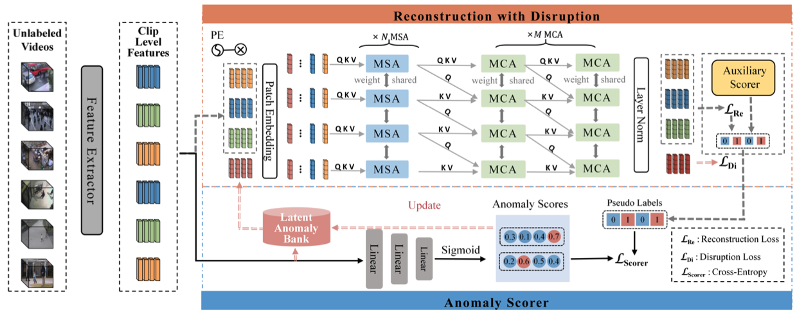
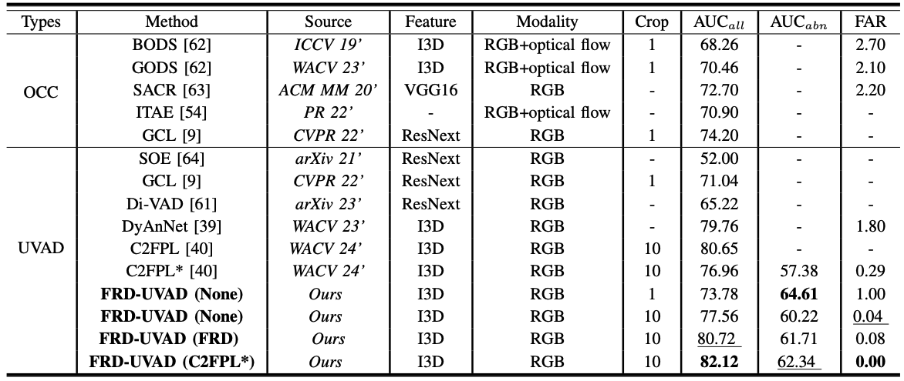
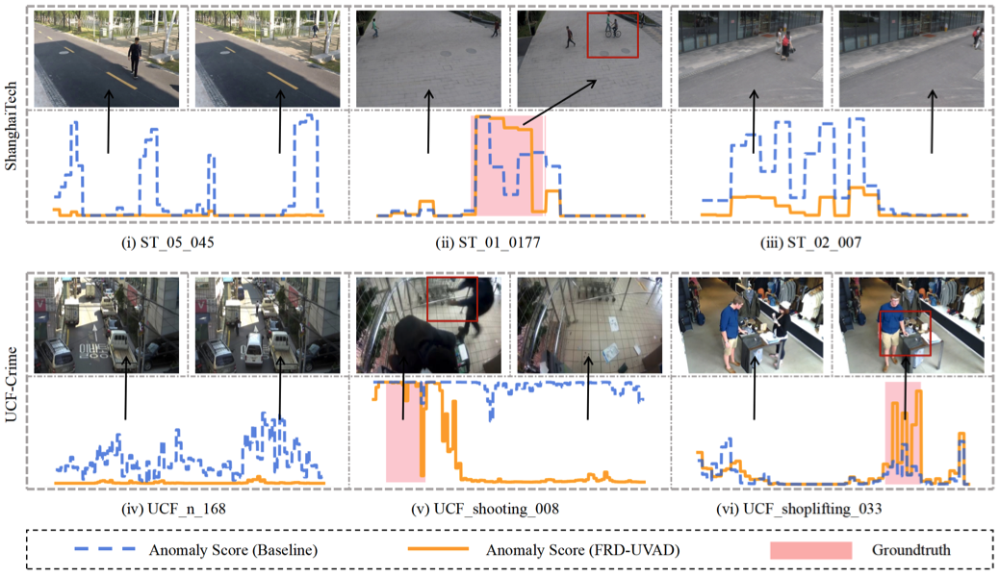

# FRD-UVAD

[//]: # ([![Open In Colab]&#40;https://colab.research.google.com/assets/colab-badge.svg&#41;]&#40;https://colab.research.google.com/drive/12Sh0j92YYmTa0oIuSEWWpPBCpIwCSVhz?usp=sharing&#41;)
[//]: # ([![HuggingFace Space]&#40;https://img.shields.io/badge/🤗-HuggingFace%20Space-cyan.svg&#41;]&#40;https://huggingface.co/spaces/Caoyunkang/Segment-Any-Anomaly&#41;)

This repository contains the official implementation of [Feature Reconstruction With Disruption for Unsupervised Video Anomaly Detection](https://ieeexplore.ieee.org/abstract/document/10539327).


## :fire:What's New
- 1crop inferencing codes and ckpts on Shanghaitech, CUHK Avenue and UCF-Crime seeing:[link](https://github.com/tcc-power/FRD-unsupervised-video-anomaly-detection-1crop)
- We have updated this repository for FRD-UVAD.
- We have published [Feature Reconstruction With Disruption for Unsupervised Video Anomaly Detection](https://ieeexplore.ieee.org/abstract/document/10539327).


## :gem:Framework
[//]: # (We found that a simple assembly of foundation models suffers from severe language ambiguity. )
[//]: # (Therefore, we introduce hybrid prompts derived from domain expert knowledge and target image context to alleviate the language ambiguity. )
We found that the former may suffer from data imbalance and high false alarm rates, while the latter relies heavily on feature.
Therefore, a novel feature reconstruction and disruption model (FRD-UVAD) is proposed for effective feature refinement and better pseudo-label generation in fully UVAD, 
based on cascade cross-attention transformers, a latent anomaly memory bank and an auxiliary scorer. 
The framework is illustrated below:

[//]: # (![Framework]&#40;SSA_assets/framework.png&#41;)



## Quick Start

### :bank:Dataset Preparation

We evaluate FRD-UVAD on four public datasets: Shanghaitech, CUHK Avenue and UCF-Crime.  

Download ucf-crime train features from here:[https://pan.quark.cn/s/e978fc6a90c8], test features from C2FPL:[Concat_test_10.npy](https://mbzuaiac-my.sharepoint.com/personal/anas_al-lahham_mbzuai_ac_ae/_layouts/15/onedrive.aspx?id=%2Fpersonal%2Fanas%5Fal%2Dlahham%5Fmbzuai%5Fac%5Fae%2FDocuments%2FApplications%2FPaper%20Submissions%2FCVPR%202024%2Fconcatenated%5Ffeatures&ga=1)**


### :hammer:Environment Setup

Run `conda env create -f environment.yaml` to install the requirements.


### :page_facing_up:Repeat the public results

**To train FRD-UVAD from scratch on UCF-Crime:**

```
python main.py --dataset_name ucfcrime --feature_pretrain_model i3d --feature_modal rgb --cross_clip 4 --lab False --lab_type wlab --beta 0.1 --delta 0.5 --Vitblock_num 8 --max_seqlen 320 --max_epoch 5 --Lambda 1_1_1
```


**To inference FRD-UVAD without auxiliary scorer,whose AUC is 77.56\%:**

```python run_test.py --ckpt_path best_ckpt/best_ckpt_0.7756.pkl```


**To inference FRD-UVAD with FRD-UVAD(1 crop) as auxiliary scorer,whose AUC is 80.72\%:**

```python run_test.py --ckpt_path best_ckpt/best_ckpt_0.8072.pkl```


**To inference FRD-UVAD with [C2FPL](https://github.com/AnasEmad11/C2FPL) as auxiliary scorer,whose AUC is 82.12\%:**

```python run_test.py --ckpt_path best_ckpt/best_ckpt_0.8212.pkl```


## :dart:Performance




## 💘 Acknowledgements

[//]: # (Our work is largely inspired by the following projects. Thanks for their admiring contribution.)
[//]: # ()
[//]: # (- [C2FPL]&#40;https://github.com/AnasEmad11/c2fpl&#41;)

We thank [C2FPL](https://github.com/AnasEmad11/C2FPL) to provide the testing features.


## Citation

If you find this project helpful for your research, please consider citing the following BibTeX entry.

```BibTex
@ARTICLE{10539327,
  author={Tao, Chenchen and Wang, Chong and Lin, Sunqi and Cai, Suhang and Li, Di and Qian, Jiangbo},
  journal={IEEE Transactions on Multimedia}, 
  title={Feature Reconstruction with Disruption for Unsupervised Video Anomaly Detection}, 
  year={2024},
  volume={},
  number={},
  pages={1-14},
  keywords={Unsupervised video anomaly detection;transformer;cross attention;feature reconstruction},
  doi={10.1109/TMM.2024.3405716}}
```
